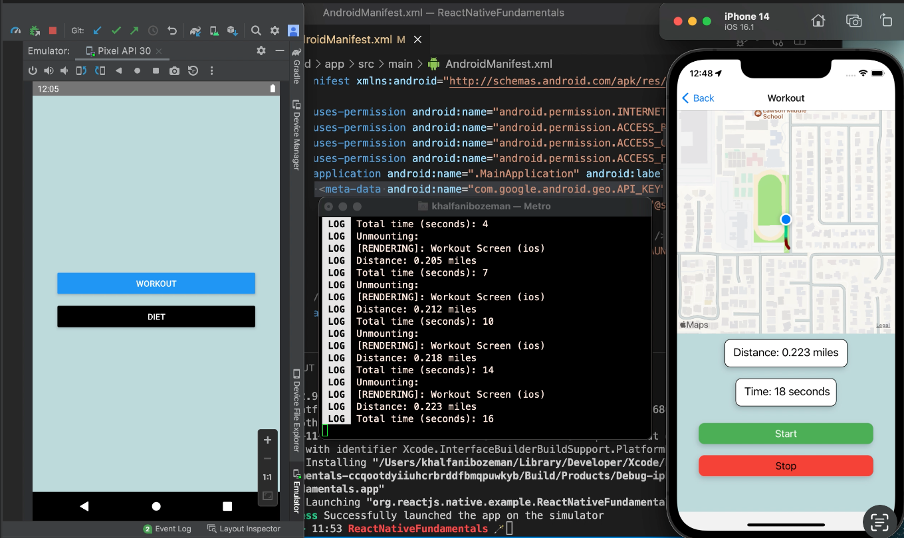

# DOCS:

- https://docs.google.com/presentation/d/1xkL1z9Y9wWIdfnLYfAYGJFkhvp7CjUOqijD_8PYPHhE/edit?usp=sharing

---

---

1. Open the whole "ReactNativeFundamentals" folder in VS code.

Android:

2. In VS code, navigate to the "AndroidManifest.xml" (ReactNativeFundamentals > android > app > src > main > AndroidManifest.xml)

3. Replace the text "YOUR API KEY HERE" with your own google maps enabled API key

4. From the "ReactNativeFundamentals" directory, open the directory "android" in Android studio

5. Press the play button in Android Studio to run the app

6. In VS code press "command + j" to open a new terminal

7. In the terminal type the command "npx react-native run-android"
   (This will run the Metro Server / send bundle to Android emulator)

Iphone:

2. In VS code press "command + j" to open a new terminal

3. Option 1: - Type the command "xed ios" - This will open the ios folder in Xcode - Press the xcode play button to run the app
   (This will start Metro Server automatically)
    
   Option 2: - Type the command 'npx react-native run-ios --simulator="iPhone 14"'
   (Most common method)

<i><b> Either scenario, a terminal should open to run the "Metro Server" This needs to stay open to see live updates and changes in the app while developing. Press "r" in the terminal window at anytime to reload the app.</b></i>
